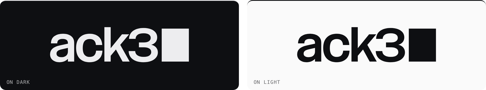
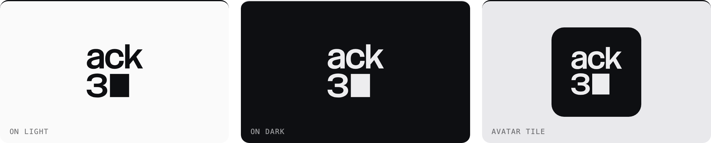
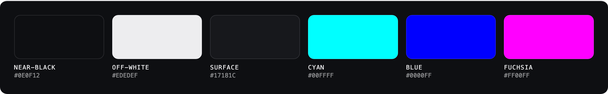

# ack3 — brand assets

Official **ack3** logo and colours for partners and audited clients placing the
mark on their own sites and materials. Grab the files, follow the short rules
below, ship it.

**[⬇ Download everything (.zip)](https://github.com/ack3-ai/ack3-brand-assets/archive/refs/heads/main.zip)** · or take individual files from the tables.

---

## Logo

The **wordmark** is the primary mark — the drawn `ack3` logotype with its block
cursor. Use it anywhere with horizontal room. The cursor is part of the mark; keep it.



| Use it on | SVG | PNG |
|---|---|---|
| Light backgrounds (dark mark) | [ack3-wordmark-on-light.svg](logo/ack3-wordmark-on-light.svg) | [ack3-wordmark-on-light.png](logo/ack3-wordmark-on-light.png) |
| Dark backgrounds (off-white mark) | [ack3-wordmark-on-dark.svg](logo/ack3-wordmark-on-dark.svg) | [ack3-wordmark-on-dark.png](logo/ack3-wordmark-on-dark.png) |
| Any (inherits your text colour) | [ack3-wordmark.svg](logo/ack3-wordmark.svg) — uses `currentColor` | — |

The **icon** stacks the wordmark to fit a square — for avatars, app tiles, and
tight spaces. Use the tile version over photos or busy backgrounds.



| Use it on | SVG | PNG |
|---|---|---|
| Light backgrounds | [ack3-icon-on-light.svg](logo/ack3-icon-on-light.svg) | [ack3-icon-on-light.png](logo/ack3-icon-on-light.png) |
| Dark backgrounds | [ack3-icon-on-dark.svg](logo/ack3-icon-on-dark.svg) | [ack3-icon-on-dark.png](logo/ack3-icon-on-dark.png) |
| Avatars / over photos | [ack3-icon-tile.svg](logo/ack3-icon-tile.svg) | [ack3-icon-tile.png](logo/ack3-icon-tile.png) |
| Any (inherits your text colour) | [ack3-icon.svg](logo/ack3-icon.svg) — uses `currentColor` | — |
| Favicon floor (16–32px) | [ack3-cursor.svg](logo/ack3-cursor.svg) — the bare cursor block on the brand tile | — |

**Embed it** — use the fixed-colour file that matches your background:

```html
<a href="https://ack3.ai" rel="noopener">
  
</a>
```

The `currentColor` files only inherit your text colour when the SVG is **inlined**
into the page (`<svg>…</svg>` pasted into your markup) — an SVG loaded through
`` cannot see your page's styles and would render black. When in doubt, use
the `-on-light` / `-on-dark` files.

**Naming:** always lowercase, one word, ending in the numeral `3` — `ack3`.
Never *Ack3*, *ACK3*, *ackee3*, or *ack 3*. (The legal entity name `ACK3 LTD` on
formal documents is the one exception.)

---

## Colours



The **logo is monochrome** — near-black or off-white only. The accents below are
for coordinating your *surrounding* design; **never recolour the mark with an accent.**

| Colour | Hex | Role |
|---|---|---|
| Near-black | `#0E0F12` | Dark surface |
| Ink | `#0A0A0C` | The mark on light |
| Off-white | `#EDEDEF` | Text / the mark on dark |
| Surface | `#17181C` | Raised panels (dark) |
| Cyan | `#00FFFF` | Reserved accent — one focal moment per page, never body text |
| Blue | `#0000FF` | Filled-button background only; blue **text** on dark uses `#6B8AFF` (pure blue fails contrast) |
| Fuchsia | `#FF00FF` | Sparse accent — a mark or a rule, never large fields, never a glow |

On light backgrounds the accents need darker working values to stay readable:
cyan `#0A8A8A`, blue text `#0000DD`, fuchsia `#BB00BB`.

---

## Usage

- **Clear space** — keep at least **half the letter height** clear on every side. The shipped files carry a little padding, but not the full clear space — don't rely on the file's edges.
- **Minimum size** — wordmark at least **24px** tall; below that use the icon (down to ~32px), and at favicon sizes (16–32px) the cursor block (`ack3-cursor.svg`).
- **Contrast** — dark mark on light, off-white mark on dark; over photos, use the tile.

**Do**
- Use the version that matches your background.
- Scale the SVG freely — it stays sharp at any size.
- Say something true, like “Audited by ack3”, and link it to the report.

**Don't**
- Recolour the mark, or add gradients, shadows, or glow.
- Stretch, rotate, distort, crop, or outline it.
- Re-typeset the name in another font, re-draw or re-space the letters, or drop the cursor block.
- Reduce the mark to a standalone “3” — the smallest form is the cursor block, never a lone numeral.
- Imply a partnership or endorsement beyond what's true, or put “ack3” in your own
  product, company, or domain name.

---

## Trademark & contact

“ack3” and the ack3 logo are trademarks of ack3. Using the mark to truthfully state
that ack3 reviewed your code (e.g. “Audited by ack3”) is welcome; anything implying
a broader endorsement is not.

Questions, or need a format that isn't here? Reach the ack3 team at [ack3.ai](https://ack3.ai).
